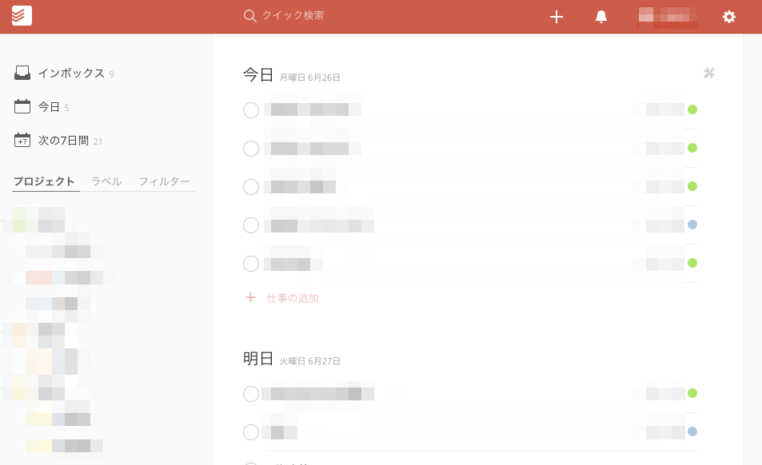
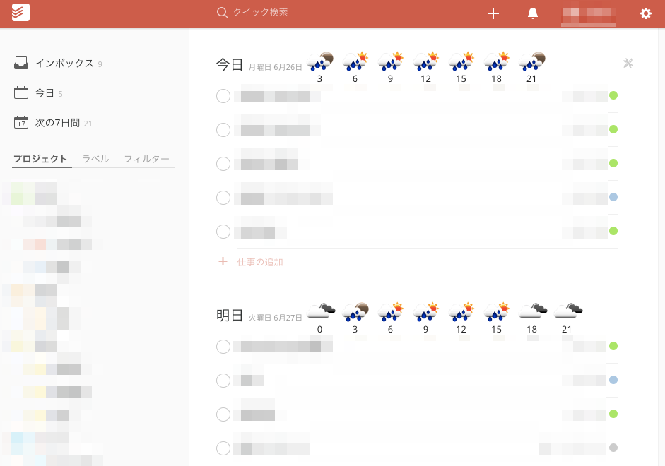

# TodoistWeather

## 概要

Todoistのタスク一覧画面に天気予報情報を追加するユーザスクリプトです。  
Chrome & Tampermonkeyで動作確認しています。  

利用する場合は内部のCITY_IDとAPI_KEYを書き換えて使用してください。  
https://openweathermap.org/ にて入手できます。  

## 適用イメージ

* before

* after

